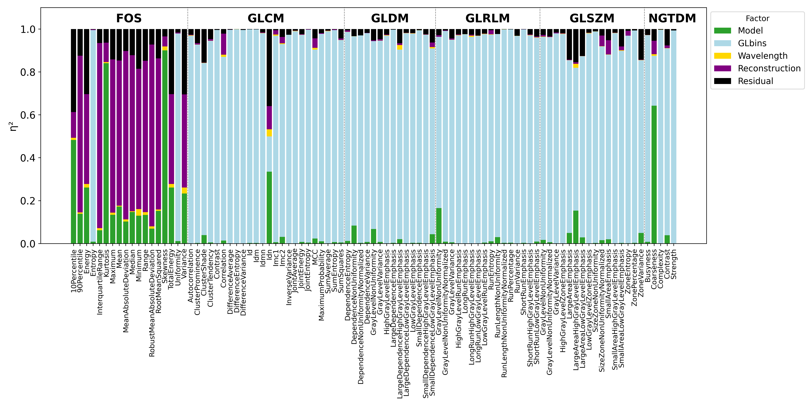
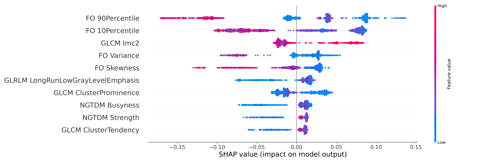
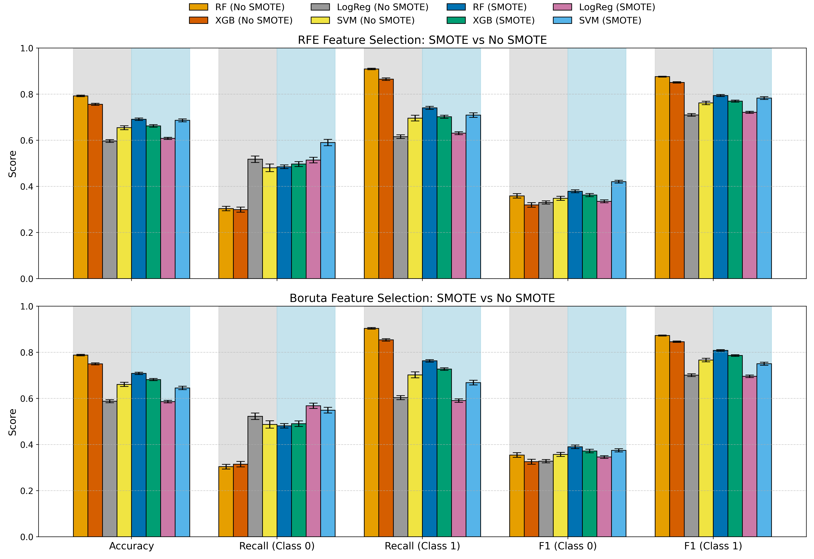
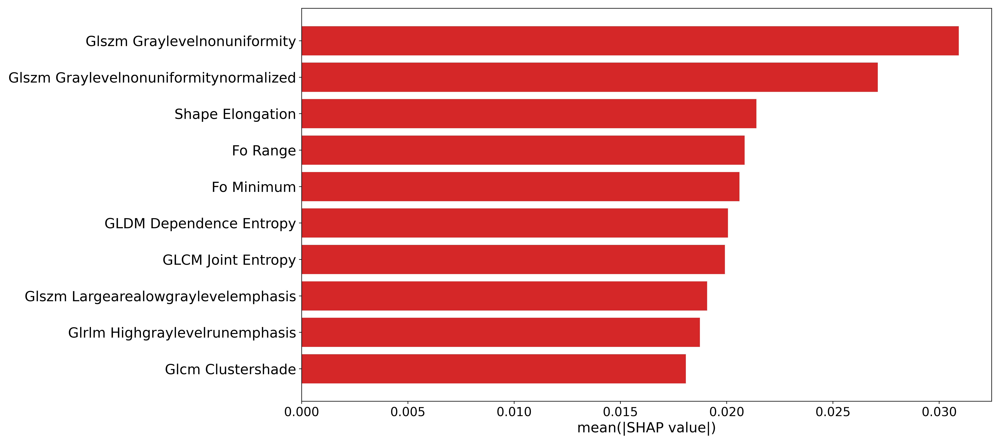
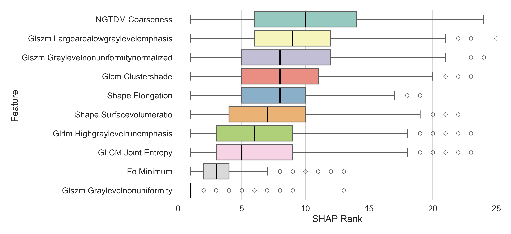

# Radiomic Feature Sensitivity and Classification in Photoacoustic Imaging and CT (MPhil Project)

This repository contains the complete code, data pipeline, and analysis for my MPhil project on radiomic feature robustness and classification across two imaging modalities:

- **Section A:** Reproduction of Escudero Sánchez et al. (2022) using full factorial ANOVA, feature selection, machine learning, and SHAP interpretability on photoacoustic imaging of breast cancer PDXs.
- **Section B:** Extension study applying the same radiomics pipeline to the LIDC-IDRI CT dataset for lung nodule classification.

---


## Key Results

**Section A:** PAI Radiomics Study

1. Sensitivity Analysis (ANOVA)

Full-factorial ANOVA revealed key radiomic features sensitive to the model type and not to confounding factors (ie: FO Skewness, FO Kurtosis).

<p align="center">  </p>

2. SHAP Analysis

SHAP values identified FO 10th percentile, FO 90th Percentile (RMS), GLCM Imc2, FO Skewness, and FO Variance as the most impactful features for the RF classifier

<p align="center">  </p>


**Section B:** LIDC-IRDI Extension Study

1. Classifier Performance Plot (RFE vs Boruta) for both original and resampled sets

<p align="center">  </p>

2. SHAP Analysis

SHAP analysis identified GLSZM Gray Level Non uniformity and its normalised counterpart as the most impactful features. Very little overlap between the PAI syudy and this, as could be expected.

<p align="center">  </p>

3. SHAP Consistency Box plots

SHAP analysis repeated over 1000 independant seeds unanimously showed GLSZM Gray Level Non Unifomity as the most influential feature.

<p align="center">  </p>


--

## Project Structure

```bash
sn665/
│
├── data/                         # Radiomic CSVs and metadata
│   ├── LIDC_Extension/           # Includes DICOM + XMLs from LIDC-IDRI plus csvs
│   ├── Photoacoustic_Study/      # PAI radiomics and metadata csvs
│   └── ModelsUncorrected/        # Radiomic Features (PAI Study) uncorrected
│
├── Finalised Notebooks/          # Final cleaned Jupyter notebooks
│   ├── ANOVA.ipynb               # Section A: ANOVA Sensitivity analysis
│   ├── MODEL_PERFORMANCE.ipynb   # Section A: Model Discrimination (ML + SHAP)
│   ├── EXTENSION.ipynb           # Section B: LIDC-IDRI Extension
│   └── params.yaml               # YAML config used in SHAP rank reproducibility
│
├── Development Notebooks/        # Early exploratory notebooks (included for reference)
│
├── MATLAB scripts (ANOVA)/       # MATLAB scripts used for full factorial ANOVA
│
├── src/                          # Custom Python modules (importable functions)
│   ├── Extension.py              # Add code used for the LIDC-IRDI extension
│   ├── feature_selection.py      # Feature selection utilities
│   ├── ML.py                     # ML training
│   ├── PAI.py                    # SHAP, ML, and ANOVA utils for Section A (PAI)
│   └── plotting.py               # Plotting functions for section A
│
├── plots/                        # Figures from Section A (PAI)
│   ├── ANOVA_plots/
│   ├── Distributions_plots/
│   ├── SHAP_plots/
│   └── misc/
│
├── plots_extension/              # Figures from Section B (LIDC-IDRI extension)
│   ├── feature_selection_plots/
│   ├── ML_plots/
│   ├── shap_plots/
│   └── misc/
│
├── Instructions.md               # Internal usage instructions
├── requirements.txt              # Python environment dependencies
├── README.md                     # This file
└── .gitignore                    # Files and folders to ignore in Git


```

--


## Environment Setup

Recommended: Python 3.9+

Install required packages using:

```bash
pip install -r requirements.txt
```

Main dependencies include:

- pandas, numpy, scikit-learn, imblearn, shap, xgboost
- pydicom, SimpleITK, pyradiomics
- matplotlib, seaborn, tqdm

--


## Reproducibility Instructions

Section A — Photoacoustic (Escudero Sanchez reproduction)
- Run: Dev_notebook.ipynb → ANOVA sensitivity analysis
- Run: Dev_notebook_2.ipynb → IQR variability plots
- Run: Dev_notebook_3.ipynb → Feature selection, ML classification, SHAP explanations


Section B — LIDC Extension (CT dataset)
- Run: Dev_notebook_4.ipynb → Full pipeline for lung CT extension

--

## Notes

- The MATLAB scripts compute full-factorial ANOVA statistics (η²) and were used for reproduction consistency.
- DICOM files used for LIDC radiomics are referenced in data/LIDC_Extension/, but not pushed due to size.
- SHAP stability was assessed using 1000 seeds with saved output (volume_results.pkl).
- To generate new results from scratch (using a new random seed), uncomment the three "to_csv" lines scattered throughout EXTENSION.ipynb. This will regenerate:
    - 3D volume reconstructions
    - Radiomic feature extraction
    - Feature selection and ML classification
    - SHAP interpretation
    - Slight variation in outputs is expected due to randomness in SMOTE and model training.

--


## Use of Generative Tools 

- I used Github's Copilot to help me automatically finish off some code blocks and also to quickly docstring my functions.

- I used LLMs (ChatGPT) to help me create professional looking plots and occasionally to help me debug errors when i implemented something incorrectly.